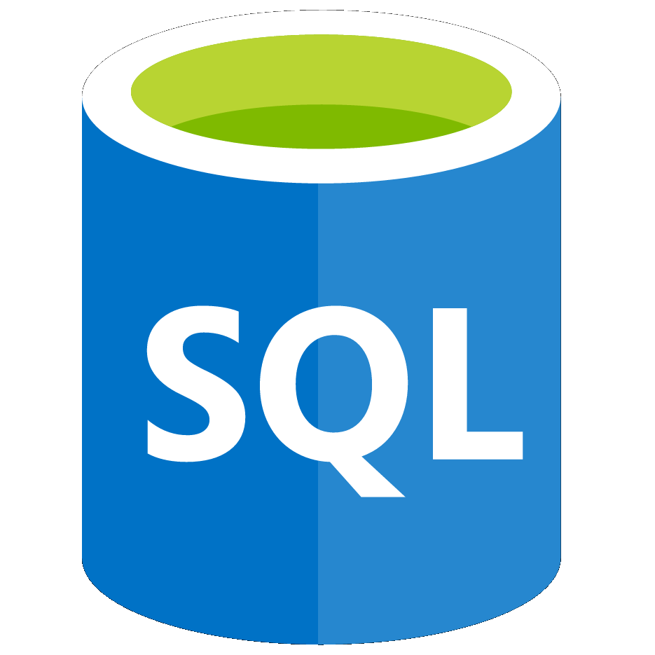

# 🍲 StockUp

## Project Overview
StockUp is a python program accessible through the terminal allowing users to manage saved their personal recipes, weekly meal plans, ingredient inventory and generate a shopping list.

<b>Full Overview</b>

StockUp provides an efficient and easy way for users to minimize waste when cooking meals and buying ingredients for said meals. The program has multiple features: 
  
<ol>
<li>
StockUp can convert the text content of both the meal-plan.txt file and recipes.txt file into dictionaries, as long as the text files follow a set of rules listed in the How to Use section below.
</li>
<li>
StockUp can add these dictionaries to a relational database.
</li>
<li>
Users can alter the data of this relational database as well as the recipes text file within the program, (meal plan text file has to be changed within the file itself).
</li>
<li>
Users can generate shopping lists for each week.
</li>
<li>
Users can add the PPU(Price per unit) of ingredients allowing for the price of each recipe/week to be calculated.
</li>
<li>
Users can have an infinite number of recipes/weeks.
</li>
</ol>
 
These features have been coded through a series of complex data structures and data manipulation using python and the extended module 'sqlite3'(a python module which allows for clear SQL queries to be executed within python). The algorithms.py file handles text file manipluation and inspection, whilst the database.py file handles database creation and manipulation through the use of the sqlite3 module. For a deeper explanation of the various functions within the python files, comments have been provided alongside the code.

## Key Features
- 🍲 Manage Recipes
- 📆 Manage Weekly Meal Plans
- 🗠 Manage Ingredient Stock Level
- 🗒️ Generate Weekly Shopping Lists
- 💷 Calculate Cost Of Meals

## Technology Stack

    
    

## Installation

### Download The Files

1) First create a folder to contain the program within the desired directory.

2) Then download all the files into that folder.

3) Make sure your folder includes the following essential files:`algorithms.py` `app.py` `database.py` `meal-plan.txt` `recipes.txt` `shopping-list.txt`

4) The program is ready to run! 😀

### Run The Program

*Disclaimer: I have not tested the program on windows so you may be able to simply click on the python file to run it however, I will show the command line process so instructions are universal.*

1) Within your terminal type `cd [YOUR DIRECTORY]`

#### For Mac or Linux

2) If you are using Mac OS or Linux, then type `python3 app.py`.

*If this doesn't work, you may be using an older version of python. If so do the following steps:*

3) Check your python version by typing `python --version` or `python3 --version`.

4) Install python3 if not installed.

5) Enjoy!

#### For Windows

2) If you are using Windows, then simply type `python app.py`.

3) Enjoy!

## Utilisation